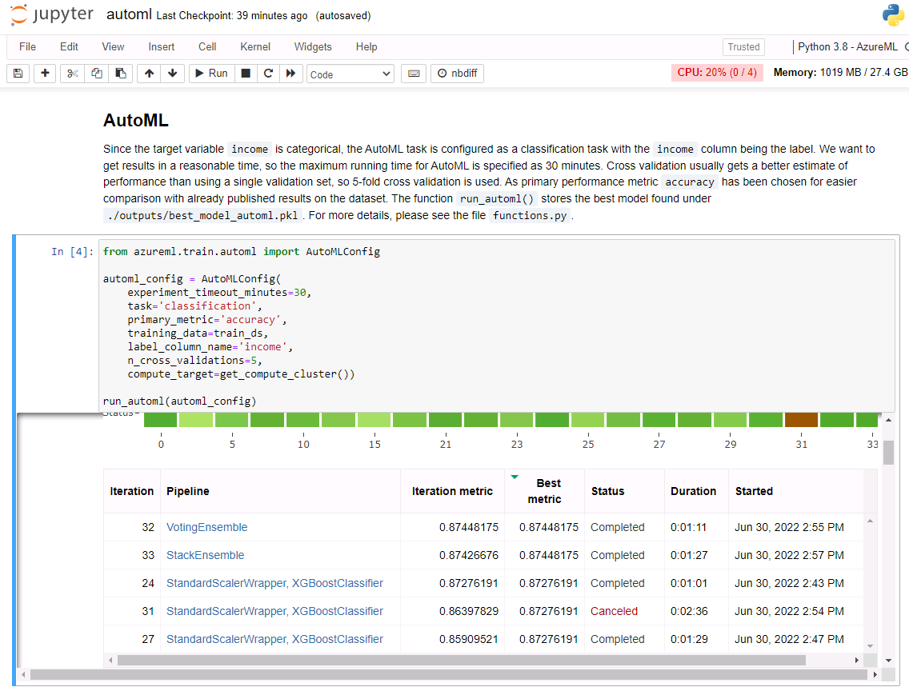

# ML Engineer with MS Azure Nanodegree - Project 3

In this capstone project, two different approaches for training models are compared. The first approach uses ML Azure's AutoML functionality, with which is possible to try different kinds of models with varying hyperparameterizations fully automatically. The second approach uses hyperdrive, which calls a manually created training script with different arguments for the hyperparameters. The performance of both approaches is compared on the public `Adult` dataset from the UCI machine learning repository.

## Project Set Up and Installation

The code of the project is distributed across different files:

* `automl.ipynb` - a Jupyter notebook for demonstrating AutoML
* `hyperparameter_tuning.ipynb` - a Jupyter notebook for demonstrating hyperparameter tuning with hyperdrive
* `functions.py` - functions which are used by the two notebooks
* `conda_dependencies_automl.yml` - Conda environment file for AutoML model deployment
* `conda_dependencies_hyperd.yml` - Conda environment file for training and deploying a model tuned by hyperdrive
* `predict_automl.py` - a Python script needed for AutoML model deployment
* `predict_hyperd.py` - a Python script needed for deploying a model tuned by hyperdrive

If not already existing, create a compute instance in Azure ML Studio and open Jupyter on the instance. Upload all previously mentioned files into Jupyter.

Before you run any of the notebook files, please create a `source_dir` directory in Jupyter and move the `predict_automl.py` and `predict_hyperd.py` scripts into this new subdirectory.

The hyperdrive training runs will use the `scikit-learn` conda package with version 1.0.2. For loading the best model from the notebook, you need to install the correct version by opening a terminal from Jupyter and running the following command from the command line:

    conda install scikit-learn=1.0.2

Once the correct version is installed, all necessary steps for AutoML and Hyperdrive can be executed by going step-by-step through the corresponding notebooks.

## Dataset

### Overview

As data for comparison between AutoML and Hyperdrive we will be using the public `Adult` dataset from the UCI machine learning repository. You can find it here:

https://archive.ics.uci.edu/ml/datasets/Adult

The records originate from the 1994 Census Database and contain the following features describing properties of individual persons:

* `age`: continuous,
* `workclass`: categorical - Private, Self-emp-not-inc, Self-emp-inc, Federal-gov, Local-gov, State-gov, Without-pay, Never-worked,
* `fnlwgt`: continuous,
* `education`: categorical - Bachelors, Some-college, 11th, HS-grad, Prof-school, Assoc-acdm, Assoc-voc, 9th, 7th-8th, 12th, Masters, 1st-4th, 10th, Doctorate, 5th-6th, Preschool
* `education-num`: continuous,
* `marital-status`: categorical - Married-civ-spouse, Divorced, Never-married, Separated, Widowed, Married-spouse-absent, Married-AF-spouse,
* `occupation`: categorical - Tech-support, Craft-repair, Other-service, Sales, Exec-managerial, Prof-specialty, Handlers-cleaners, Machine-op-inspct, Adm-clerical, Farming-fishing, Transport-moving, Priv-house-serv, Protective-serv, Armed-Forces,
* `relationship`: categorical - Wife, Own-child, Husband, Not-in-family, Other-relative, Unmarried.
* `race`: White, Asian-Pac-Islander, Amer-Indian-Eskimo, Other, Black,
* `sex`: categorical - Female, Male,
* `capital-gain`: continuous,
* `capital-loss`: continuous,
* `hours-per-week`: continuous
* `native-country`: categorical - United-States, Cambodia, England, Puerto-Rico, Canada, Germany, Outlying-US(Guam-USVI-etc), India, Japan, Greece, South, China, Cuba, Iran, Honduras, Philippines, Italy, Poland, Jamaica, Vietnam, Mexico, Portugal, Ireland, France, Dominican-Republic, Laos, Ecuador, Taiwan, Haiti, Columbia, Hungary, Guatemala, Nicaragua, Scotland, Thailand, Yugoslavia, El-Salvador, Trinadad&Tobago, Peru, Hong, Holand-Netherlands,
* `income`: categorical - >50K, <=50K.

Downloaded can be datasets for training and testing.

### Task

The task is to predict if the income of a person is greater than 50K or below it, depending on all other features.

### Access

The `functions.py` file contains helper functions for downloading the data from the web, cleaning it, encoding the categorical data items (in the case of using hyperdrive) and uploading the preprocessed data as a tabular dataset to a blobstore in the workspace. From there it can be accessed by AutoML and the hyperdrive training script.

The data has been preprocessed in the following way:

* Rows with any missing values have been removed
* Spaces have been removed from values of categorical features
* Dots have been removed from values of categorical features
* The first line of the test set in CSV format has been removed, because it is not compliant with the CSV format

For using random forests in the hyperdrive runs, the `LabelEncoder` class from scikit-learn has been used to replace all categorical values (i.e. strings in the data) by corresponding integer values.

## Automated ML

The AutoML run is configured as classification task for the label column `income`. For easier comparison with published result `accuracy` is chosen as the primary metric. The performance is assessed using 5-fold cross validation. The run should time out after 30 minutes.

### Results

The best found AutoML model is a voting ensemble model consisting of 10 different classifiers. Depending on the classifier, different scalers for the data are used. 

The first classifier in the ensemble is a LightGBM classifier based on gradient boosting. It contains itself of different decision trees. This type of classifier is in itself an ensemble method which combines differently weighted weak decision tree stumps. The only specified parameter is `min_data_in_leaf=20`, i.e. that at least 20 samples have to be in the leafs of the trees. The second classifier is a XGBoost classifier without any specified parameters. The two classifiers have the highest (and equal) weight (0.21) in the ensemble. 

The rest of the classifiers have equal weight (0.071) and include - among many XGBoost classifiers - also a random forest and a wrapper for stochastic gradient descent (SGD). Important hyperparameters tuned for XGBoost are, for instance, the learning rate `eta`, the maximum depth of the trees `max_depth`, the number of combined trees `n_estimatos`, the fraction of training examples used for fitting the trees `subsample`, the fraction of columns to be randomly sampled per tree `colsample_bytree` and parameters for weight regularization `reg_alpha` and `reg_lambda`.

The screenshot above shows the results from the AutoML run.

The screenshot shows details about the best model found by AutoML.

The voting ensemble achieves an accuracy of about 87.5% on the training set and about **87.6%** on the test set. Results might even improve by allowing for a longer running time of the AutoML run. The results from AutoML are impressive in so far as the achieved accuracy is higher than the results published on the UCI website. 

## Hyperparameter Tuning

The classifier chosen for hyperparameter tuning is a random forest. Decision tree based classifiers are especially well-suited for categorical features of which the `Adult` dataset contains many. As an ensemble method, the random forest combines different decision trees and is usually more powerful than a single tree.

The hyperparameter search tunes the following parameters in the given ranges:

* `n_estimators`: number of decision trees in the forest (2 to 100)
* `max_depth`: maximum depth of the involved decision trees (2 to 10)
* `max_features`: maximum number of features randomly chosen per decision tree (1 to 14)
* `min_samples_leaf`: minimum fraction of samples per leaf (0.01 to 0.1)

Limiting the maximum number of features which can be used may increase the variety of the involved decision trees. Limiting the maximum depth of the trees helps in avoiding overly complex trees and thereby overfitting. Similarly, ensuring that leafs contain a minimum fraction of samples helps to avoid overfitting, because the less samples are contained in a leaf, the more specialized branches have become.

### Results

The above screenshot shows details about the hyperdrive run. Unfortunately, the view was not correctly updated at the end, since the best model is not the one shown in the first row of the table. It was correctly shown in the _Trials_ view of Azure ML Studio, though.

The above screenshot shows properties of the best random forest found by the Hyperdrive run and its performance on the test set. 

The best model of 100 trials yields a cross-validated accuracy of 84.002% on the training set. On the test set, it gives an accuracy of **83.834%**.

The best found model had the following parameters:

* `n_estimators`: 57,
* `max_depth`: 9,
* `max_features`: 11,
* `min_samples_leaf`: 0.013049

It can be observed in general that the parameter `min_samples_leaf` has the most influence on the accuracy, where larger values in many cases lead to worse performance. Lower values for `max_depth` and `max_features` can lead to worse performance as well. The parameter `n_estimators` doesn't seem to have any strong correlations with performance.

## Model Deployment

Since the AutoML model shows better performance, it has been chosen for deployment (note though that the project also contains code for deploying the model found by hyperdrive).

The endpoint for the registered model `adult-automl-model` is named `adult-automl-service`. For deployment, an according entry script has been provided, which loads the best model found by the AutoML run. To send requests to the model via a REST API, we need to get the endpoint`s URI. Then we can use the HTTP post method to send a JSON string encoding the input data for which we want to get a prediction, e.g.:

    {
    "age": 25,
    "workclass": "Federal-gov",
    "fnlwgt": 226802,
    "education": "Some-college",
    "education-num": 7,
    "martial-status": "Never-married",
    "occupation": "Armed-Forces",
    "relationship": "Other-relative",
    "race": "White",
    "sex": "Male",
    "capital-gain": 0,
    "capital-loss": 0,
    "hours-per-week": 40,
    "native-country": "Canada"
    }

The endpoint will return the predicted income category (i.e. either `>50K`or `<=50K`).

## Screen Recording

*TODO* Provide a link to a screen recording of the project in action. Remember that the screencast should demonstrate:

- A working model
- Demo of the deployed  model
- Demo of a sample request sent to the endpoint and its response

## Standout Suggestions

Unfortunately, due to other work obligations, I didn't find the time to attempt any of the standout suggestions.
